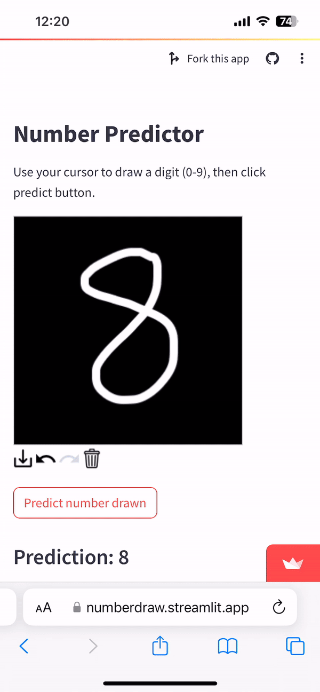

# henrym105.github.io
##### author: Henry Marquardt, Dec 2023

Use this streamlit app to draw a number with your mouse / finger. 
Click redict and the neural network will predict which number is drawn!
- built with pytorch & torchvision
- works on Mobile and Desktop browsers

<!--  -->

